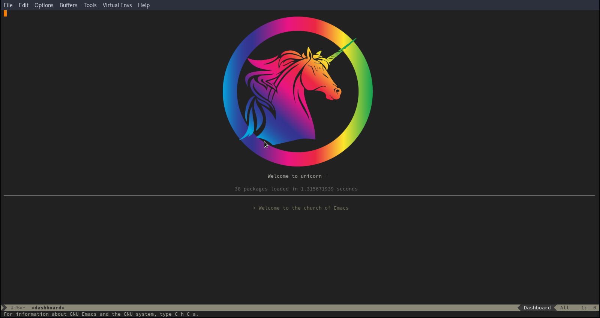

<!-- PROJECT LOGO -->
 

  <a href="https://github.com/othneildrew/Best-README-Template">
    <!--img src="unicorn/logo.png" alt="Logo" width="400" height="400"-->

  </a>
 

  <h3 align="center">Unicorn emacs</h3>

# under development not use !!!
